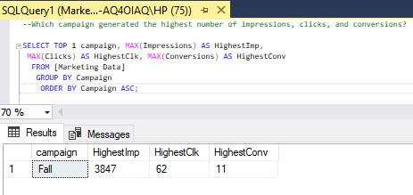
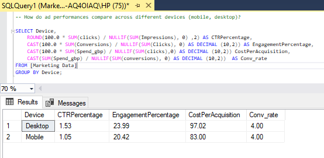

# Marketing Campaign PerformanceAnalysis  
# SQL | Power BI


# Table of contents

- [Project brief](#Projectbrief)
- [Objective](#Objective)
- [Key Questions to Answer](#KeyQuestionstoanswer)
- [Data source](#Datasource)
- [Tools](#Tools)
- [Dashboard design charts](#Dashboarddesignchart)
- [Stages](#Stages)
- [Dataprocessing&Transformation](#Dataprocessing/Transformation)
- [Findings](#Findings)
- [Recommendations](#Recommendations)

# Project Brief: Marketing Campaign Performance Analysis

# Objectives
This project aims to analyze marketing data to gain insights into the effectiveness of campaign performance, optimize the ad spend, and improve future marketing strategies.

•	Evaluate Campaign Performance: Assess the overall performance of each campaign in terms of reach, engagement, and conversions.

•	Channel Effectiveness: Determine which advertising channels are driving the best results.

•	Geographical Insights: Identify the cities that show the highest engagement and conversion rates.

•	Device Performance: Understand how ads perform across different devices.

•	Ad-Level Analysis: Analyze the performance of individual ads to identify high-performing creatives.

•	ROI Calculation: Calculate the return on investment (ROI) for each campaign.

•	Time Series Analysis: Track the performance trends over time to identify patterns and seasonal effects.

## Key Questions to Answer

1.	Campaign Performance: Which campaign generated the highest number of impressions, clicks, and conversions? What is the average cost-per-click (CPC) and click-through rate (CTR) for each campaign?

3.	Channel Effectiveness: Which channel has the highest ROI? How do impressions, clicks, and conversions vary across different channels?
   
5.	Geographical Insights: Which cities have the highest engagement rates (likes, shares, comments)? What is the conversion rate by city?
   
7.	Device Performance: How do ad performances compare across different devices (mobile, desktop, tablet)? Which device type generates the highest conversion rates?
   
9.	Ad-Level Analysis: Which specific ads are performing best in terms of engagement and conversions? What are the common characteristics of high-performing ads?
    
11.	ROI Calculation: What is the ROI for each campaign, and how does it compare across different channels and devices? How does spend correlate with conversion value across different campaigns?
    
13.	Time Series Analysis: Are there any noticeable trends or seasonal effects in ad performance over time? 

# Data Source


## Tools

| Tools | Purpose | 
| --- | --- | 
| SQL |  Cleaning, Transformation, Processing |
| POWER BI | DAX Measures, Visualizations | 


# Dashboard Design
Here’s how I played around with the datasets using right chart visuals to tell a compelling story.

1.	Score cards
2.	Column chart
3.	Donut chart
4.	Line chart
5.	Clustered bar/column chart
6.	Bar chart
7.	Tree map


## Stages
Here’s a step-by-step guide on how the data was approached 

1.	Get the data from source
2.	Load data into SQL
3.	Clean and process with SQL
4.	Export to Power BI for visualizations
5.	Generate Insights
6.	Give recommendations 

## Data Processing & Transformation
This section contains the cleaning process and transformation and metrics used in arriving at the right analysis/ results.

``` sql

-- (1) Which campaign generated the highest number of impressions, clicks, and conversions? (2) What is the average cost-per-click (CPC) and click-through rate (CTR) for each campaign?

SELECT TOP 1 campaign, 			-- Highest number of imp, clk, and conv
  MAX(Impressions) AS HighestImp, MAX(Clicks) AS HighestClk, 
  MAX(Conversions) AS HighestConv
FROM [Marketing Data]
GROUP BY Campaign
ORDER BY Campaign ASC;

```


``` sql

SELECT campaign, 				-- Average CPC and CTR for each campaign
  AVG(daily_average_cpc) AS CPC,  AVG(CTR) AS C_T_R
FROM [Marketing Data] 
GROUP BY Campaign;

```


``` sql

--  (1) Which channel has the highest ROI? (2) How do impressions, clicks, and conversions vary across different channels?

SELECT TOP 1 Channel, 					-- Highest ROI 
  ROUND (SUM(total_conversion_value_gbp - Spend_GBP), 2) / 
  NULLIF(SUM(Spend_GBP),  0)  AS AmtSpent
FROM [Marketing Data]
GROUP BY Channel 
ORDER BY AmtSpent DESC;

```


``` sql 

SELECT Channel, 					-- Imp, clk, and conv across channels
   ROUND (100.0 * SUM(Clicks) / NULLIF(SUM(Impressions),0), 2) AS CTR,
   ROUND (100.0 * SUM(Conversions) / NULLIF (SUM (clicks), 0), 2) AS CVR,
   ROUND (100.0 * SUM(Conversions) / NULLIF (SUM (impressions), 0),2) AS CPI
FROM [Marketing Data] 
GROUP BY Channel;

```


``` sql

--  (1) Which cities have the highest engagement rates (likes, shares, comments)? (2) What is the conversion rate by city?

SELECT City_Location, 				-- cities highest engagement rates
  SUM(Likes_reactions + Comments + Shares) AS Engagement_Rates 
FROM [Marketing Data]
GROUP BY City_Location
ORDER BY Engagement_Rates DESC;

```


``` sql

SELECT City_location, 					-- conversion rate by city
  ROUND(100.0 * SUM(Conversions) / NULLIF(SUM(Clicks), 0),2) AS CVR 
FROM [Marketing Data]
GROUP BY City_Location
ORDER BY CVR DESC;

```


``` sql

-- (1) How do ad performances compare across different devices (mobile, desktop, tablet)? (2) Which device type generates the highest conversion rates?

SELECT Device, 		-- Ad performance across devices (mobile, desktop)
  ROUND(100.0 * SUM(clicks) / NULLIF(SUM(Impressions), 0) ,2) AS CTRPercentage,
  CAST(100.0 * SUM(Conversions) / NULLIF(SUM(Clicks), 0) AS DECIMAL (10,2)) AS Engment%,
  CAST(100.0 * SUM(Spend_gbp) / NULLIF(SUM(clicks),0) AS DECIMAL (10,2)) AS CPA
  CAST(SUM(Spend_gbp) / NULLIF(SUM(conversions), 0) AS DECIMAL (10,2))  AS Conv_rate
FROM [Marketing Data]
GROUP BY Device;

```


``` sql

SELECT TOP 1 Device, 			-- Highest conv by device type
  SUM(Conversions) AS HighConversion
FROM [Marketing Data]
GROUP BY Device
ORDER BY HighConversion DESC;

```


``` sql

-- (1) Which specific ads are performing best in terms of engagement and conversions? (2) What are the common characteristics of high-performing ads?

SELECT Channel, 			-- Ads performance by engagement and conversions
 ROUND(100.0 * SUM(clicks) / NULLIF(SUM(impressions) ,0),2) AS C_T_R,	
 ROUND(100.0 * SUM(likes_reactions + shares + clicks) / NULLIF(SUM(impressions), 0),2) AS EngRate,
 ROUND(100.0 * SUM(Spend_gbp) / NULLIF(SUM( likes_reactions + shares + clicks),0),2) AS CpEng,
 ROUND(100.0 * SUM(conversions) / NULLIF(SUM(clicks),0),2) AS CVRate,	
 SUM(Spend_gbp) / NULLIF(SUM(conversions),0) AS CPCV,
 CAST(100.0 * SUM(total_conversion_value_gbp) / NULLIF(SUM(spend_GBP),0)AS DECIMAL (10,2) ) AS ROADS
FROM [Marketing Data]
GROUP BY Channel;

```


``` sql

-- (1) What is the ROI for each campaign, and how does it compare across different channels and devices?
-- (2) How does spend correlate with conversion value across different campaigns?

WITH CampaignROI AS ( SELECT channel, Device,
	SUM(Spend_GBP) AS AdSpend,
	SUM(total_conversion_value_gbp - spend_gbp)  AS CampaignNetProfit
FROM [Marketing Data]
GROUP BY Channel, Device ) SELECT Channel, Device,
	ROUND(100.0 * SUM(CampaignNetProfit) / SUM(Adspend),2) AS ROI
FROM CampaignROI
GROUP BY Channel, Device
ORDER BY Channel ASC;	-- Campaign ROI, compare across different channels and devices

```


``` sql

SELECT Channel,
	COUNT(conversions) AS DeviceCNV,
	SUM(Spend_gbp) / NULLIF(SUM(conversions),0) AS CostPerConversion,
	ROUND(100.0 * SUM(Spend_gbp) / NULLIF(SUM(conversions),0),2) AS ConversionRate
FROM [Marketing Data]
GROUP BY Channel
ORDER BY ConversionRate DESC; -- spend correlation with conv value across diff campaigns


``` 


``` sql 

-- Are there any noticeable trends or seasonal effects in ad performance over time? 

SELECT 							-- seasonal ad performance 

    DATEPART(YEAR, Date) AS Year,
    DATENAME(MONTH, Date) AS MonthName,
    SUM(Spend_gbp) AS TotalSpend,
    SUM(Conversions) AS TotalConversions,
    SUM(Total_conversion_value_gbp) AS TotalRevenue,
    CASE WHEN SUM(Clicks) > 0 
         THEN ROUND(SUM(Conversions) * 100.0 / SUM(Clicks) ,2)
         ELSE 0 END AS ConversionRate,
    CASE WHEN SUM(Spend_gbp) > 0 
         THEN CAST(SUM(Total_conversion_value_gbp) / SUM(Spend_gbp) AS DECIMAL (10,2))
         ELSE 0 END AS ROAS
FROM [Marketing Data] 
GROUP BY DATEPART(YEAR, Date), DATENAME(MONTH, Date) 
ORDER BY MonthName,ConversionRate DESC;

```


## Insights

•	The fall campaign performs best across all key metrics. It significantly outperforms spring and summer campaigns with Impressions: 6,434,259, Clicks: 85,120, Conversions: 14,886.

•	Fall has the highest CTR (1.35%) but also the highest CPC (£0.93). Spring offers the most cost-efficient clicks at £0.86 CPC. Summer has the lowest CTR (1.13%) with CPC nearly as high as Fall (£0.92)

•	Pinterest dominates with an exceptional 2150.68% ROI, significantly outperforming Instagram (980.15%) and Facebook (475.85%). This suggests Pinterest delivers far more conversion value relative to spend.

•	Facebook delivers the most impressions but has the lowest conversion rate (CVR) of 18.77%. Instagram achieves the highest CTR (1.42%) and second-highest CVR (22.71%). Pinterest has the lowest CTR but highest CVR (26.83%), making the ROI standout.

•	London shows the highest overall engagement with 285,706 total interactions, followed by Manchester (278,159) and Birmingham (237,874).

•	Birmingham has the highest conversion rate at 28.79%, and outperforms Manchester (22.86%) and London (17.61%). This suggests Birmingham audiences are more likely to convert after clicking.

•	Desktop generates more conversions (21,310 vs 18,942) and has higher CTR (1.53% vs 1.05%). Mobile is slightly more efficient with lower CPA (£20.42 vs £23.99) and CPC (£0.83 vs £0.97). Conversion rates are nearly identical (4%) across devices.

•	Desktop with higher conversion value (£949,684) but also higher spend (£86,187)

•	Mobile has lower absolute conversion value (£782,016) but more efficient spend (£76,994)

•	Pinterest continues to show exceptional ROI performance. Instagram delivers strong middle-ground performance. Facebook has the lowest ROI among the three channels.

•	There's a strong positive correlation between spend and conversion value, but with diminishing returns at higher spend levels. Pinterest shows the most efficient spend-to-conversion ratio.

•	Fall consistently outperforms other seasons across all metrics. Spring shows steady performance with efficient CPC. Summer has the weakest performance with lower CTR and higher CPC.

## Recommendations
•	Invest more in Pinterest for its exceptional ROI performance.

•	Grant more budget to Fall campaigns when consumer responsiveness peaks.

•	Optimize Birmingham-targeted ads to leverage the higher conversion rates.

•	Maintain balanced device spending as both desktop and mobile performs well.

•	Study high-performing ad characteristics and do the same for other campaigns.

•	Monitor seasonal trends to expect performance fluctuations.

•	Test London engagement strategies in other cities to boost interaction rates.

